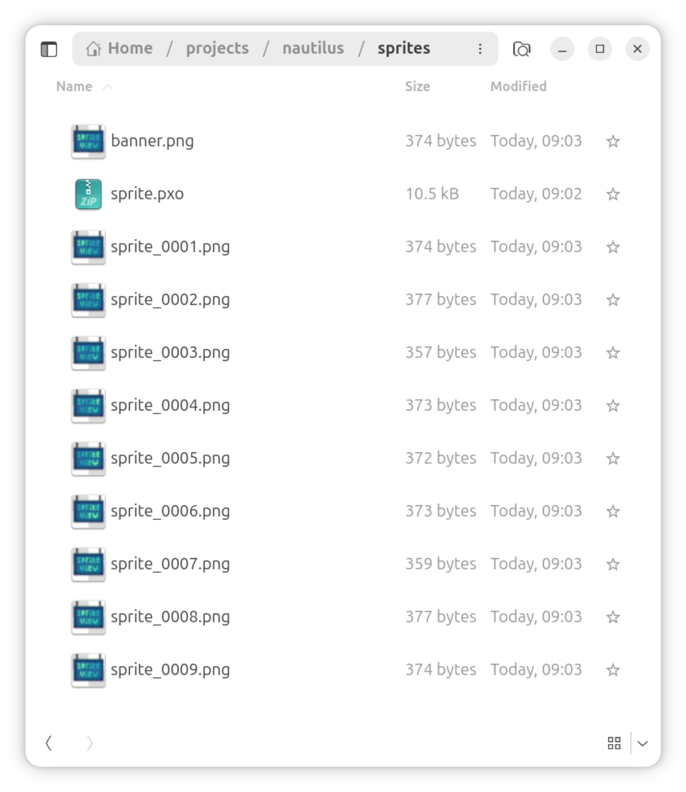
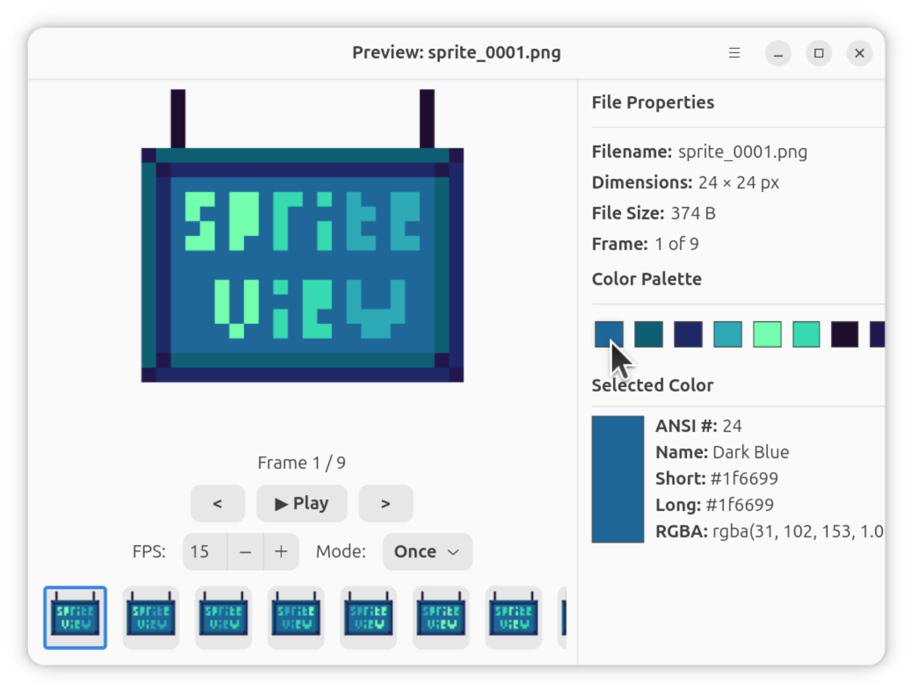

<!-- SPDX-FileCopyrightText: 2026 Uwe Jugel -->
<!-- SPDX-License-Identifier: AGPL-3.0-or-later -->
# SpriteView

A lightweight GTK4 image viewer for Linux — built for pixel artists and developers.
Run it from the terminal, set it as your default image viewer, or use it directly inside GNOME Files.

**Website:** <https://ubunatic.com/spriteview> · **Repo:** <https://codeberg.org/ubunatic/spriteview>




## Features

- **Crisp scaling** — nearest-neighbor integer upscaling keeps pixel art sharp
- **Cursor-centered zoom** — scroll to zoom towards the cursor, keyboard zoom towards the last zoom center
- **Pixel color picker** — inspect individual pixel colors; configurable image background and border
- **Sprite animation** — play/pause/step, 1–60 FPS spinbutton, loop/ping-pong/once modes
- **Smart sequencing** — select one frame, SpriteView detects and loads the full sequence
- **Multi-file** — pass multiple files or a folder directly from the CLI
- **Color palette** — extracts top 16 colors per frame with ANSI 256 / hex / RGBA detail on click
- **Properties panel** — filename, dimensions, file size, frame count
- **Export** — headless PNG/GIF/WebM/ICO export, or `--export` to open the advanced GUI dialog
- **Persistent settings** — default FPS, sequence separators, filename patterns
- **GNOME Files integration** — right-click "Preview Image" / "Preview Sprite Sheet" in Nautilus
- **Desktop integration** — `.desktop` entry with MIME associations and "Open With" support

## Install

```bash
curl -sSL https://codeberg.org/ubunatic/spriteview/raw/branch/main/scripts/install.sh | bash
```

The script installs the `spriteview` CLI to `~/.local/bin/`, registers the `.desktop` entry
and MIME types, and (if `python3-nautilus` is present) installs the Nautilus extension.

**Prerequisites for GNOME Files integration** (optional):

```bash
sudo apt install python3-nautilus   # Ubuntu / Debian / Linux Mint
sudo dnf install nautilus-python    # Fedora / RHEL
sudo pacman -S nautilus-python      # Arch / Manjaro
```

**Pillow (PIL)** is required for interactive crop and some export paths —
most GTK4 desktop environments already ship it, but if you hit an
`ImportError: No module named PIL`, install it:

```bash
sudo apt install python3-pil        # Ubuntu / Debian / Linux Mint
sudo dnf install python3-pillow     # Fedora / RHEL
sudo pacman -S python-pillow        # Arch / Manjaro
```

## Usage

```bash
spriteview <image>                  # preview a single image
spriteview <image> [<image> ...]    # preview as animation sequence
spriteview <folder>                 # open file picker at folder
spriteview <image> --export gif     # headless export (png, gif, webm, ico)
spriteview <image> --export         # open advanced export dialog
spriteview --settings               # open settings window
spriteview --about                  # open about dialog
```

## Project Structure

```
sprite_view.py          entry point and CLI (also the Nautilus extension)
sprite_view/            app modules
  ui/preview.py         main viewer window
  ui/settings.py        settings dialog
  ui/about.py           about dialog
  settings.py           settings persistence
  logo.py               app icon / logo rendering
  utils.py              color utilities, sequence detection
scripts/install.sh      installation script
scripts/pack.py         packs modules into a single self-contained file
spriteview.desktop      desktop entry (MIME associations, actions)
website/                project website (fully static)
```

## Development

```bash
make test               # syntax check, unit tests, REUSE lint
make install            # pack, install, restart Nautilus
make test-desktop       # validate installed .desktop entry and test gio launch
make uninstall          # remove all installed files
```

See [CONTRIBUTING.md](CONTRIBUTING.md) for coding conventions and the issue process.

## License

[AGPL-3.0-or-later](LICENSES/AGPL-3.0-or-later.txt)
