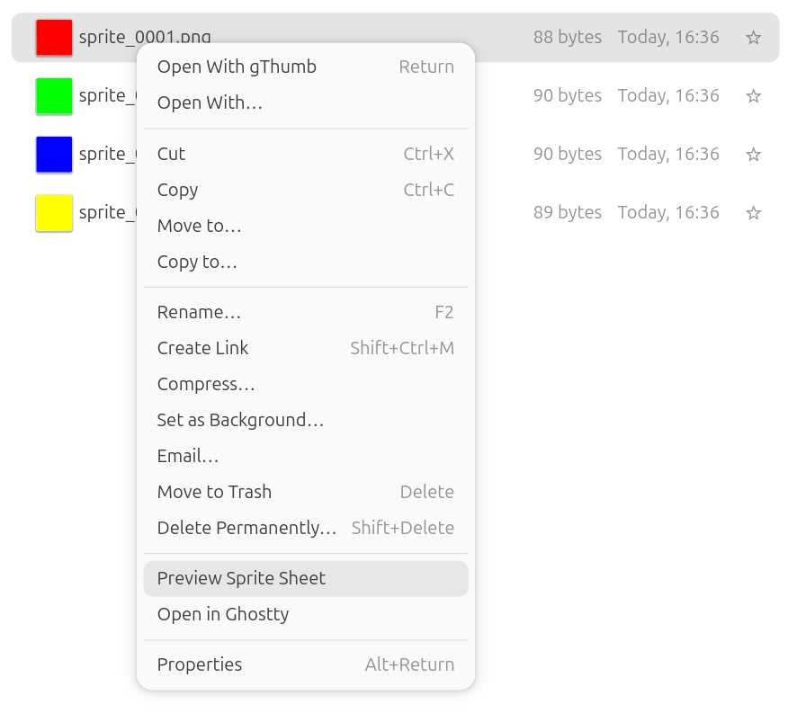
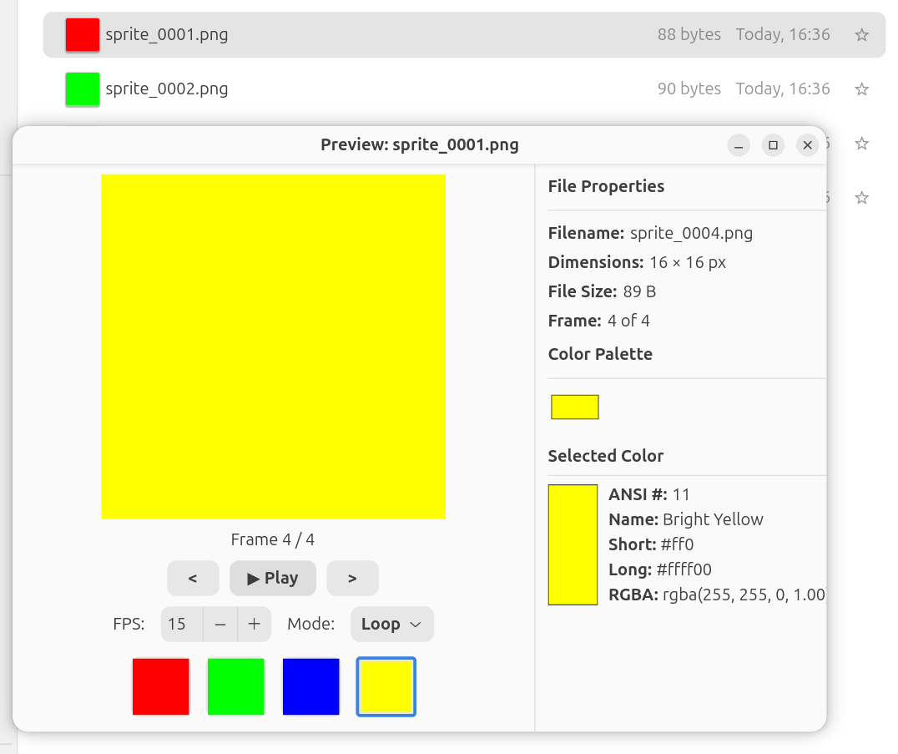

# Nautilus Image Preview Plugin

Modern GNOME Files (Nautilus) Python extension for Ubuntu 26.04 LTS ("resolute").




This plugin adds a `"Preview Image"` (or `"Preview Sprite Sheet"`) action to the right-click context menu of image files (`.png`, `.gif`, `.bmp`, `.jpg`, `.jpeg`, `.webp`). When activated, it opens a custom split-pane GTK4 window to preview the image:
*   **Crisp Scaling**: Small pixel-art/PNG/GIF/BMP images undergo nearest-neighbor (point) integer upscaling beforehand. This ensures they are rendered with crisp, sharp pixels rather than a blurry filter when scaled to fit the window.
*   **Multi-File Selection**: Select multiple individual image files simultaneously in Nautilus to load them directly as sequential frames for custom animation sequence playback.
*   **Properties Panel**: A dedicated sidebar displays metadata properties (filename, original dimensions, file size, frame count).
*   **Color Palette**: Automatically extracts the top 16 most common colors in the active frame and displays them as colored swatches inside a wrapping layout grid. Swatch widgets are recycled dynamically to preserve hover tooltips even while animations play.
*   **Interactive Color Info**: Clicking on any color swatch reveals a details panel in the sidebar showing its visual representation, closest ANSI 256 color index/name (determined by Euclidean distance), shorthand hex format (`#fff`), full hex (including alpha transparency if present), and RGBA formats.
*   **Playback Controls**: For sprite sequences, it provides animation controls (Play, Pause, Step Next, Step Prev), a clickable visual frame thumbnail strip, a **dynamic FPS (Frames Per Second) speed control** (using a `Gtk.SpinButton` from `1` to `60` FPS), and **multiple playback modes** (Loop, Ping-Pong, and Once via a modern GTK4 `Gtk.DropDown` selector).
*   **Persistent Settings**: Access a standalone Settings window via the title bar hamburger menu to configure your default FPS, toggle "Remember FPS" (by sheet or by directory scope), and define the default playback mode.
*   **Native About Page**: Includes a custom About page featuring an embedded, pixel-perfect rendering of the first sprite frame as the program logo.

## Installation

### 1. Prerequisites

Ensure you have the Python 3 bindings for Nautilus components installed:

```bash
sudo apt install python3-nautilus
```

### 2. Install the Plugin

You can install the plugin with a single command:

```bash
curl -sSL https://codeberg.org/nautilus-spriteview/raw/branch/main/scripts/install.sh | bash
```

## Make Targets

This project features a self-documenting Makefile conforming to our Make conventions. Run `make` (or `make help`) to view available targets:

```bash
$ make
  help          show this help
  test          run syntax check on the Python extension
  test-sprites  generate test sprite files (sprites/sprite_0001.png to sprites/sprite_0004.png)
  install       install the extension and restart Nautilus
  uninstall     uninstall the extension and restart Nautilus
  restart       restart Nautilus to apply changes
```

## Project Structure

*   [Makefile](file:///home/uwe/projects/nautilus/Makefile) — The self-documenting Makefile.
*   [sprite_view.py](file:///home/uwe/projects/nautilus/sprite_view.py) — The Nautilus Python extension.
*   [scripts/install.sh](file:///home/uwe/projects/nautilus/scripts/install.sh) — A POSIX/Bash conformant installation script.

## Code Standards Adhered To

1.  **Make Standards**:
    *   Phony sentinel `⚙️` used to keep targets clean.
    *   Self-documenting target descriptions matching regex format.
    *   Aligned assignment operators.
2.  **Bash Standards**:
    *   Header configuration `set -euo pipefail`.
    *   Strict usage of `if test` instead of `[`/`]` or `[[`/`]]`.
    *   Single-line `then` statements and indentation conventions matching `Bash.md`.
3.  **Python, Gtk4 & Nautilus**:
    *   Compatible with the Nautilus 4.0+ (GTK4) model-based API (no `window` arguments in provider methods).
    *   Safely instantiates and presents Gtk4 windows inside the Nautilus main loop without calling blocking main loops (`Gtk.main()`) or unsafe exits.
    *   Leverages `GdkPixbuf` and `Gdk.Texture` to perform nearest-neighbor scaling dynamically.

## License

AGPL 3.0
