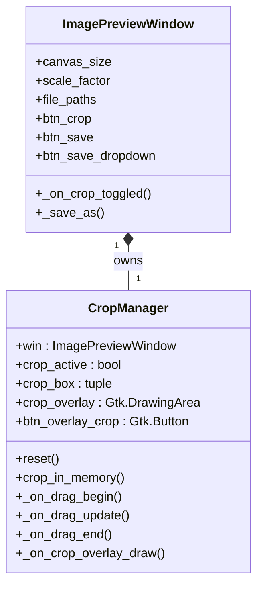

<!-- SPDX-FileCopyrightText: 2026 Uwe Jugel -->
<!-- SPDX-License-Identifier: AGPL-3.0-or-later -->

# Interactive Crop and Save Architecture

This document captures the architectural decisions, design choices, and technical pitfalls encountered when implementing the interactive crop and save features in Sprite View.

## Architectural Design

To adhere to the codebase modularity guidelines, all interactive crop functionalities are separated from the main preview window class (`ImagePreviewWindow`) and encapsulated into the `CropManager` class under [sprite_view/ui/crop.py](file:///home/uwe/projects/spriteview/sprite_view/ui/crop.py).

### Class Relationships

### Flow of Execution
1. **Entering Crop Mode**: Toggled via `btn_crop` in the titlebar, which calls `_on_crop_toggled()`. This sets `crop_active = True` and initializes `crop_box` to cover the middle 50% of the image canvas.
2. **Dragging/Drawing**: Consolidated inside `CropManager` using `Gtk.GestureDrag`.
3. **Resizing/Moving**:
   - Resizing checks proximity to any of the 8 visual handles. If within `18.0px`, it enters `drag_handle` resizing mode.
   - Moving checks if the mouse coordinates lie inside the current crop selection box. If so, it enters `move_mode` to translate the box.
4. **Snapping & Clamping**: Coordinates are rounded to source pixels and clamped to the canvas bounds.
5. **Execution**: Clicking the "Crop" overlay button or pressing `Enter` calls `crop_in_memory()`, performing in-memory crop slicing on `GdkPixbuf.Pixbuf` and `PIL.Image` frames, then clears the crop state.

---

## Technical Insights & Pitfalls

### 1. Dynamic Texture Upscaling
To ensure small pixel art sprites are crisp and readable, Sprite View upscales texture frames dynamically during load (`scale_factor = max(1, min(1024 // w, 1024 // h))`).
- **Pitfall**: Failing to store the calculated scale factor back to the window state (`win.scale_factor`) causes the coordinate translation methods (mapping crop bounds from widget space to texture space to canvas space) to use the default scale factor `1`. This results in the visual crop helpers being rendered extremely small and shifted far to the top-left of the widget area.
- **Solution**: Save the texture upscaling factor to `self.scale_factor` inside `_build_textures()` so all drawing and drag calculations scale correctly.

### 2. Gesture Collisions (Clicks vs. Drags)
- **Pitfall**: Having a separate `Gtk.GestureClick` and `Gtk.GestureDrag` on the same drawing area creates collisions. A simple click fires `pressed` (from the click controller) followed immediately by `drag-begin` and `drag-end` (from the drag controller). The drag-end callback, seeing a tiny displacement (<2px), assumes the user wants to cancel the crop selection and triggers `reset()`, causing the crop box to flash and instantly disappear.
- **Solution**: Consolidate all mouse/touch actions into a single `Gtk.GestureDrag`. Inside the `_on_drag_end` callback, detect a click by checking if the displacement is small (`abs(offset_x) < 5.0 and abs(offset_y) < 5.0`) and handle clicks/outside-clicks accordingly without gesture clashing.

### 3. Coordinate Bounds Layout
- **Pitfall**: When drawing overlay items (using Cairo on a `Gtk.DrawingArea` overlaid inside a `Gtk.Overlay`), the drawing area may not automatically align or size correctly.
- **Solution**: Explicitly set alignment flags (`halign` and `valign` to `FILL`) on the drawing area widget, and pass down the allocated width and height (`w` and `h` arguments in GTK4 draw callback) to coordinate layout systems rather than querying `widget.get_width()` (which might return 0 during early layout cycles).
